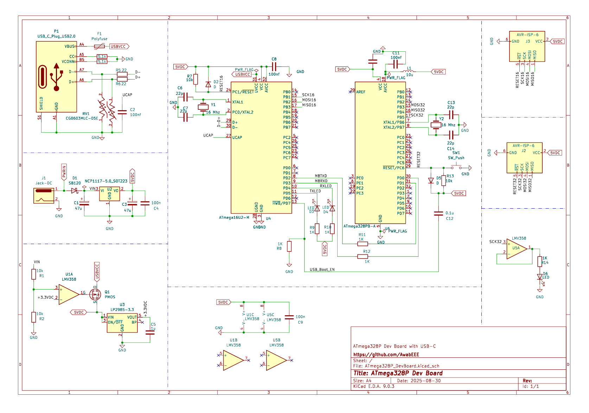
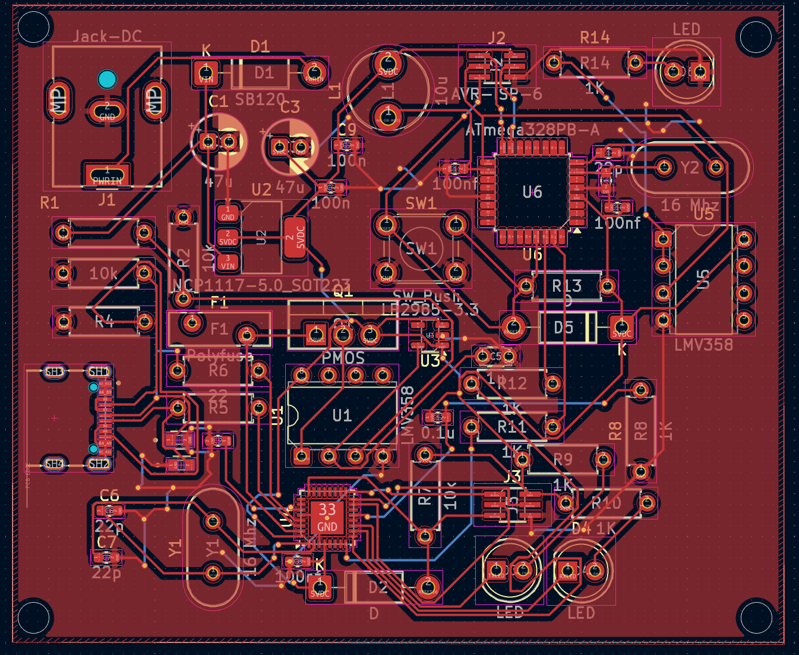
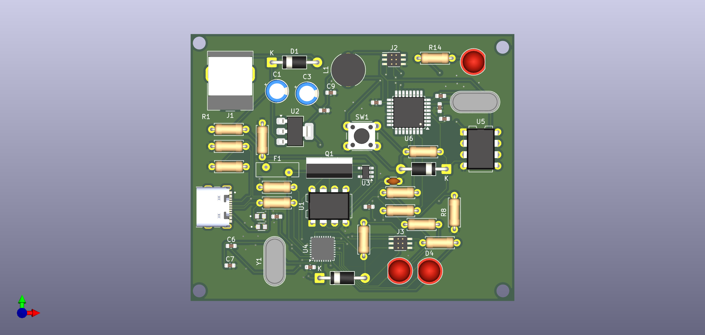
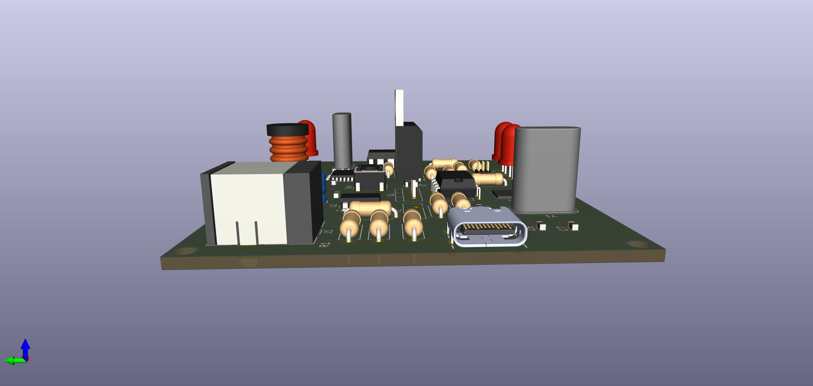
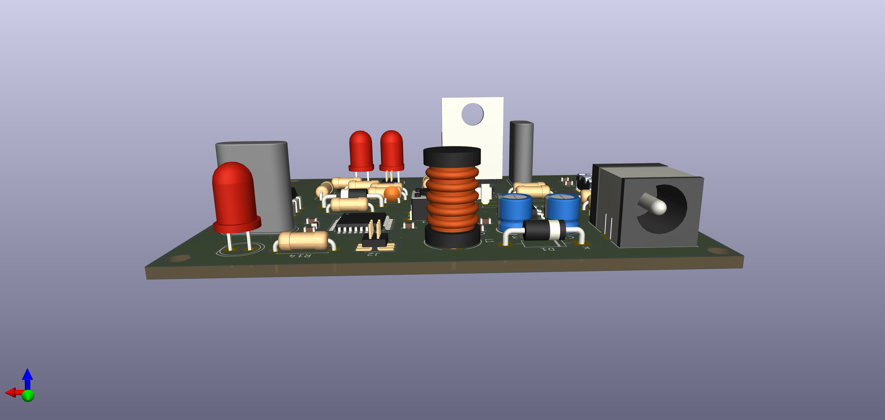

## ATmega328P Development Board with USB-C

This repository contains the **KiCad project files** and PCB design for an **ATmega328P-based development board**, featuring a USB-C connector for programming and power. The design integrates power regulation, USB-to-serial interface, ISP headers, and additional circuitry to make prototyping with the ATmega328P simple and reliable.

---

##  Circuit Overview

The board is built around the **ATmega328P microcontroller**, the same MCU used in Arduino Uno/Nano platforms.

Key functional blocks:

- **USB-C Interface (P1)**
  - Provides power and USB connectivity.
  - Includes **polyfuse protection** and **ESD diode array** for safety.

- **Power Regulation**
  - **NCP1117-5.0** linear regulator generates 5V from DC jack input.
  - Onboard circuitry generates **3.3V rail** using LM2936 or equivalent regulator.
  - Decoupling capacitors placed for stability.

- **ATmega16U2 (U4)**
  - Used as **USB-to-UART bridge** to program the ATmega328P over USB-C.

- **ATmega328P-M (U5)**
  - Main MCU, clocked by a **16 MHz crystal**.
  - Breakout of I/O pins for prototyping.
  - Reset circuit, ISP headers for flashing bootloaders.

- **Op-amp (LMV358)**
  - Provides level shifting and buffering for certain peripherals.

- **Indicators & Reset**
  - Power LED, TX/RX activity LEDs.
  - Reset button connected to ATmega328P reset line.

This board is essentially a **custom ATmega328P dev board** with Arduino compatibility, powered and programmed directly via USB-C.

---

##  Previews

### Schematic

### PCB Layout

### PCB 3D Renders
 
 

---

##  Getting Started

1. Clone this repository:
   \`\`\`bash
   git clone https://github.com/AwabEEE/ATmega328P-Development-Board-with-USB-C.git
   \`\`\`
2. Extract \`ATmega328P_DevBoard.rar\` and open in **KiCad 9.0+**.
3. To program the ATmega328P:
   - Use the **USB-C interface (with ATmega16U2)** for serial programming.
   - Or connect via the **ISP headers** to burn bootloader/firmware.

---

##  Notes

- Designed for **5V operation** with optional **3.3V rail**.
- Follow USB-C current and voltage specifications for safety.
- Recommended for embedded projects, Arduino prototyping, and educational purposes.

---

## License
This project is dedicated to the public domain under [CC0 1.0](https://creativecommons.org/publicdomain/zero/1.0/).

---

##  Author

**Awab** [@AwabEEE](https://github.com/your-username](https://github.com/AwabEEE))

